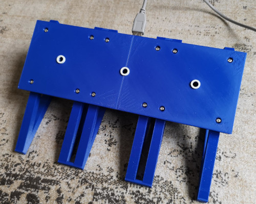
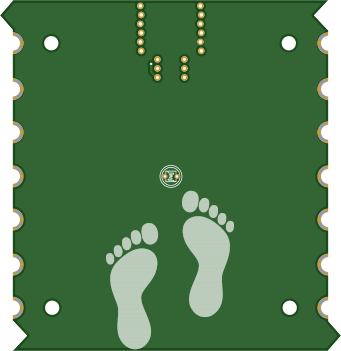
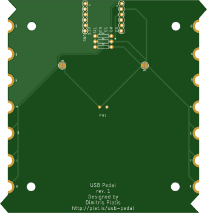

# ToeTap
A human interface device for your toes 🦶⌨️

## What is ToeTap?

ToeTap is a minimalist USB keyboard and mouse that you control by tapping your toes.
It's designed to be used as a foot pedal for gamers, video makers and editors or anyone who wants to keep their hands free while working in front of a computer.
I use it to scroll through my script while recording videos because I hate moving my hand away just to scroll. It shows a bit on the video and it's annoying.
You can easily adjust it to perform any keyboard or mouse action you want. With up to 3 inputs and no moving parts, it's a simple and reliable tool that you can use to improve your workflow.

Compared to commercial foot pedals, ToeTap is probably slightly cheaper if you know how to solder and can program an Arduino. It's also infinitely more customizable since, you know, it's open source. 🍹

## How does it work?

ToeTap is made of some hardware that involve various components, custom made PCBs and a 3D printed case. It's controlled by an Arduino Pro Micro clone, which is a small board that can act as a USB keyboard or mouse. The ATmega32U4 microcontroller by Microchip is connected to 3 photoresistors that are used to detect when you tap/step on them.

### Hardware

The following components are necessary to build ToeTap:
- 3x [ToeTap PCBs](https://www.pcbway.com/project/shareproject/ToeTap_USB_Controller_7fb3b714.html)
- Arduino Pro Micro clone in a "square" form factor where the USB port is part of the board
  - It is often marketed as `Mini SS Micro ATMEGA32U4`
  - You may need to add some electrical tape on the USB side to make sure it doesn't wiggle when you connect it
- 9x 220Ω resistors
- [3D-printed components](https://www.tinkercad.com/things/i6qfPpNWuRz-toetap)

#### PCB Assembly

To build a fully-fledged ToeTap you will need to solder 3 of the ToeTap PCBs together. The PCBs are designed to be soldered together side by side, with the photoresistors on the top side and everything else on the bottom side. The photoresistors are used to detect when you tap on the ToeTap. The bottom side of the PCBs is where the microcontroller and the resistors are soldered.
Additionally, on the bottom side of the two "side" PCBs, you need to solder the "pad" facing towards the middle PCB. By soldering the PCBs together AND the corresponding pads, you will be able to get all the PCBs to work together as a single unit. The pads of the middle PCB should be left unsoldered.
If you need more detailed instructions, open an issue and I'll be happy to help you out.

### Software

The software is written in C++ and is designed to be compiled with the Arduino IDE.
Some basic filtering is applied to the photoresistor readings to detect when you tap on the ToeTap. The readings are then used to trigger a keyboard or mouse action. The software is designed to be easily customizable, so you can change the keybindings and the sensitivity of the ToeTap to suit your needs.
